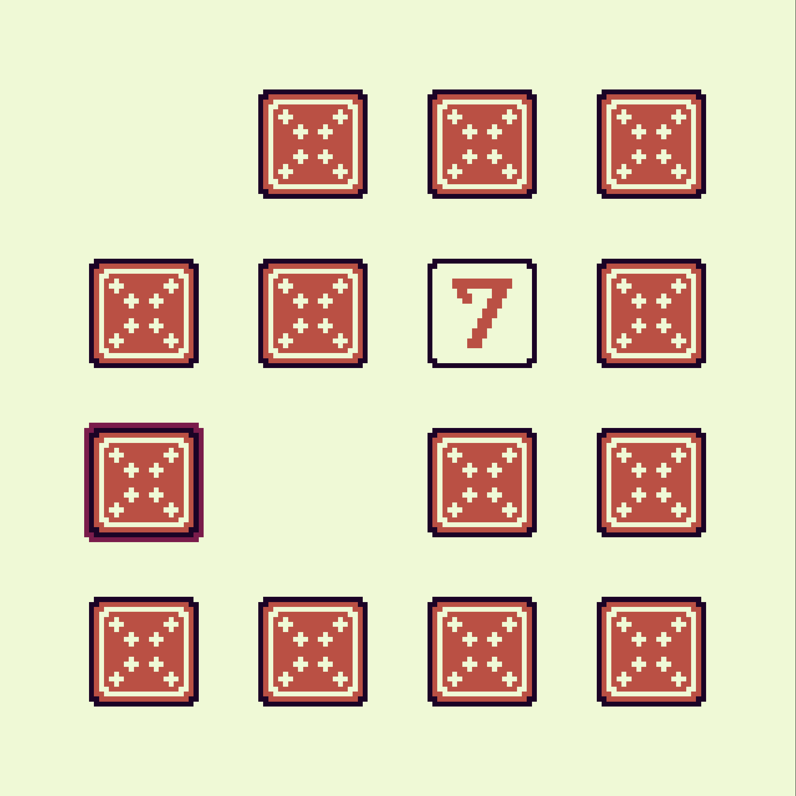

# memory-game

A game written in Zig for the [WASM-4](https://wasm4.org) fantasy console.

## Play Now!

You can play the game on your browser: [Memory Game](https://phcarvalho.github.io/wasm4-memory-game/)



## Building

Build the cart by running:

```shell
zig build -Doptimize=ReleaseSmall
```

Then run it with:

```shell
w4 run zig-out/bin/cart.wasm
```

For more info about setting up WASM-4, see the [quickstart guide](https://wasm4.org/docs/getting-started/setup?code-lang=zig#quickstart).

## Links

- [Documentation](https://wasm4.org/docs): Learn more about WASM-4.
- [Snake Tutorial](https://wasm4.org/docs/tutorials/snake/goal): Learn how to build a complete game
  with a step-by-step tutorial.
- [GitHub](https://github.com/aduros/wasm4): Submit an issue or PR. Contributions are welcome!
